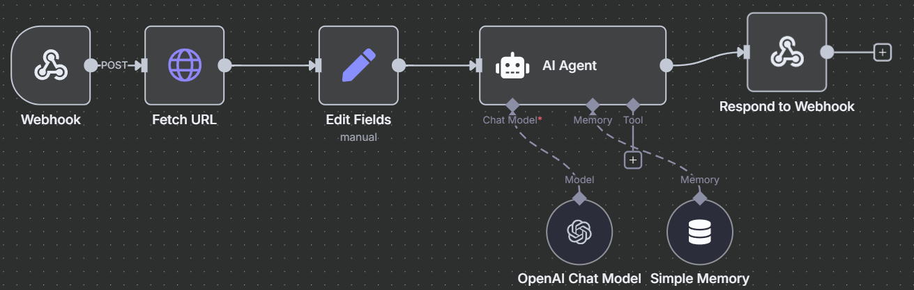
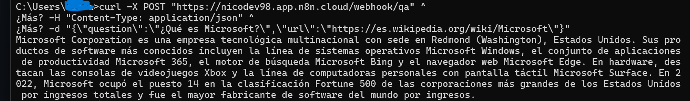

# 🤖 QA Mini-RAG – n8n Cloud + OpenAI API

  
  
-00A67E?logo=openai)  


> 🧠 **QA Mini-RAG** es un flujo creado 100% en **n8n Cloud**, que implementa un sistema de **Preguntas y Respuestas (Q&A)** basado en IA con un enfoque **RAG (Retrieve → Augment → Generate)** y **memoria contextual**.  
> Utiliza la **API de ChatGPT (OpenAI)** para procesar información extraída desde fuentes externas (por ejemplo, Wikipedia) y generar respuestas inteligentes en tiempo real.

---

## 🧩 Arquitectura General



```text
Webhook → Fetch URL → Edit Fields → AI Agent → Respond to Webhook
                                 │
                           OpenAI Chat Model
                                 │
                           Simple Memory
```

## 🔁 Flujo Paso a Paso

| Etapa | Nodo | Descripción |
|-------|------|-------------|
| 🛰️ **Retrieve** | Fetch URL | Recupera información desde una fuente externa. Si el enlace pertenece a Wikipedia, obtiene automáticamente el resumen mediante su API REST. |
| 🧱 **Augment** | Edit Fields | Limpia y normaliza el texto recuperado, generando un "contexto" que se usará como base para responder la pregunta. |
| 💬 **Generate** | AI Agent (OpenAI) | Envía la pregunta y el contexto al modelo de ChatGPT para producir una respuesta precisa y coherente. |
| 🧠 **Memory** | Simple Memory | Mantiene el historial de conversación y contexto a corto plazo por sesión. |
| 📡 **Output** | Respond to Webhook | Devuelve la respuesta en formato JSON a quien haya hecho la petición POST. |

## ⚙️ Tecnologías Utilizadas

- ☁️ **n8n Cloud** – Motor de automatización sin código.
- 🧠 **OpenAI Chat Model (API de ChatGPT)** – Generación de texto contextual.
- 🌐 **Fetch URL Node** – Recupera contenido de la web o APIs REST.
- 🧰 **Edit Fields Node** – Limpieza y procesamiento de datos.
- 💾 **Simple Memory** – Persistencia temporal del contexto.
- 🔗 **Webhook Node** – Punto de entrada HTTP para integraciones externas.

## 🚀 Ejemplo de Uso

### 1️⃣ Ejecutar con curl desde CMD o Terminal:

```bash
curl -X POST "https://tucuentan8n.app.n8n.cloud/webhook/qa" ^
-H "Content-Type: application/json" ^
-d "{\"question\":\"¿Qué es Microsoft?\",\"url\":\"https://es.wikipedia.org/wiki/Microsoft\"}"
```

### 2️⃣ Respuesta esperada:

```json
{
  "respuesta": "Microsoft Corporation es una empresa tecnológica multinacional con sede en Redmond (Washington), Estados Unidos. Sus productos más conocidos incluyen la línea de sistemas operativos Microsoft Windows, Microsoft 365 y el navegador web Microsoft Edge, entre otros."
}
```

## 🧠 Cómo Funciona el Mini-RAG



1. **Retrieve**: Se descarga contenido desde una URL (idealmente Wikipedia).
2. **Augment**: El nodo Edit Fields limpia el HTML y extrae el texto relevante.
3. **Generate**: El AI Agent (OpenAI) procesa la pregunta junto con ese contexto y devuelve una respuesta natural.
4. **Memory**: El nodo Simple Memory almacena las últimas interacciones para mantener el contexto en múltiples preguntas del mismo usuario.

## 🔮 Próximos Pasos / Evolución a RAG Completo

| Nivel | Descripción | Mejoras posibles |
|-------|-------------|------------------|
| 1️⃣ **Simple** (actual) | Recupera texto directo desde fuentes y genera respuestas. | ✅ Implementado. |
| 2️⃣ **Avanzado** | Agregar "AI Embeddings" y almacenamiento vectorial (Chroma / Pinecone). | 🔜 RAG semántico. |
| 3️⃣ **Multi-Agente** | Un agente busca, otro resume y otro responde. | 🔜 Orquestación de agentes IA. |
| 4️⃣ **Dinámico** | RAG + herramientas externas (API, DB, buscadores). | 🔜 Integración total con sistemas. |

## 📋 Estructura del Proyecto

```
📁 QA Mini-RAG/
├── 📄 QA_MiniRAG.json.json    # Flujo de n8n exportado
└── 📄 README.md               # Documentación del proyecto
```

## 🔧 Configuración

### Requisitos Previos

1. **Cuenta de n8n Cloud** activa
2. **API Key de OpenAI** configurada en credenciales n8n
3. **Credenciales de OpenAI** configuradas en el nodo correspondiente

### Importación del Flujo

1. Accede a tu instancia de n8n Cloud
2. Importa el archivo `QA_MiniRAG.json.json`
3. Configura las credenciales de OpenAI
4. Activa el workflow

### Variables de Entrada

El webhook acepta los siguientes parámetros:

- `question` (string, requerido): La pregunta que se desea responder
- `url` (string, requerido): URL de la fuente de información (preferiblemente Wikipedia)
- `sessionId` (string, opcional): ID de sesión para mantener contexto

### Ejemplo de Payload

```json
{
  "question": "¿Cuáles son las características principales de Python?",
  "url": "https://es.wikipedia.org/wiki/Python",
  "sessionId": "user-123"
}
```

## 🛠️ Personalización

### Modificar el Modelo de IA

Para cambiar el modelo de OpenAI, edita el nodo "OpenAI Chat Model" y selecciona:
- `gpt-4o-mini` (recomendado para costos)
- `gpt-4o` (mayor precisión)
- `gpt-3.5-turbo` (más económico)

### Ajustar la Memoria

El nodo "Simple Memory" puede configurarse para:
- Cambiar el tamaño del buffer de memoria
- Modificar la clave de sesión
- Ajustar el tiempo de retención

### Personalizar el Prompt

Edita el nodo "AI Agent" para modificar:
- El prompt del sistema
- Las instrucciones de respuesta
- El formato de salida

## 🧑‍💻 Autor

**Nicolás Parra Muñoz**  
Desarrollador Full Stack / QA Engineer • Chile 🇨🇱

- 💼 [LinkedIn](https://www.linkedin.com/in/nicolas-antonio-parra-mu%C3%B1oz-1a341b173)
- 📧 nico.antonio.parra98@gmail.com

## 🪄 Licencia

Este proyecto es de libre uso para fines educativos y de portafolio.  
Si reutilizás este flujo, se agradece la mención a su autor original.

## 🧭 Créditos

- Desarrollado con ❤️ en **n8n Cloud**
- Potenciado por **OpenAI ChatGPT API**
- Arquitectura RAG inspirada en principios de **LangChain** y retrieval semántico

---

## 📊 Estadísticas del Flujo

- **Nodos**: 6
- **Conexiones**: 6
- **Tipo**: Webhook → AI Agent
- **Memoria**: Buffer Window
- **Modelo**: GPT-4o-mini
- **Estado**: Activo

## 🔍 Troubleshooting

### Problemas Comunes

1. **Error de credenciales**: Verifica que la API key de OpenAI esté configurada correctamente
2. **URL no válida**: Asegúrate de que la URL sea accesible y contenga información relevante
3. **Sin contexto**: El flujo requiere que la URL proporcione contenido extraíble

### Logs y Debugging

- Revisa los logs de ejecución en n8n Cloud
- Verifica la respuesta del nodo "Fetch URL"
- Comprueba que el contexto se esté generando correctamente en "Edit Fields"

---

*Última actualización: Agosto 19 2025*
